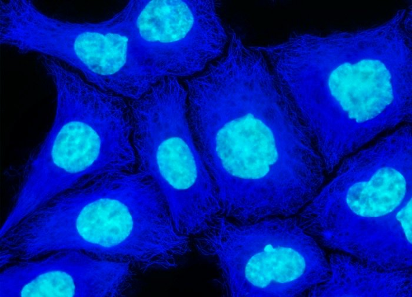

Image files in this directory
=====
  
Phase contrast  
  
Differential interference contrast  
-----

  
Fluorescence composite  
-----

  
Nuclear stain (DAPI; usually blue channel)
  
PhosphoERK stain (Alexa488; usually green channel)
-----
 
 
 
